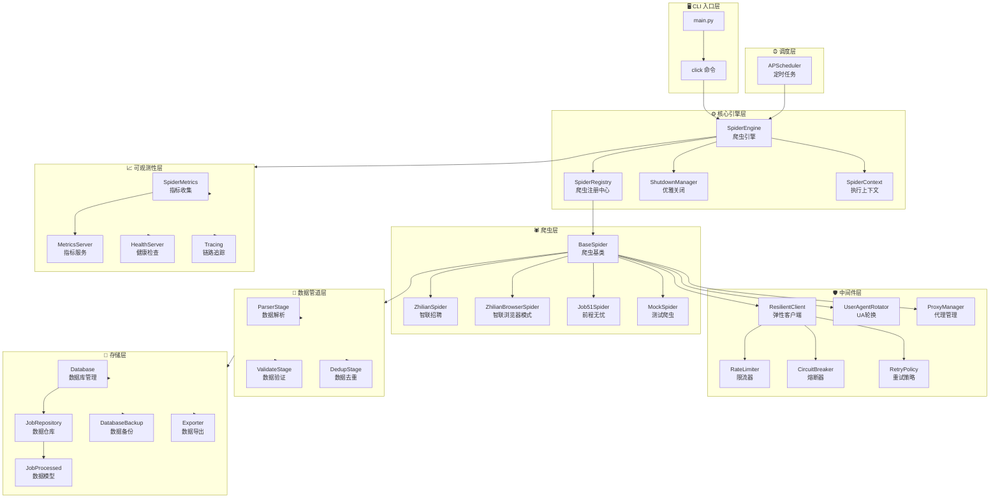
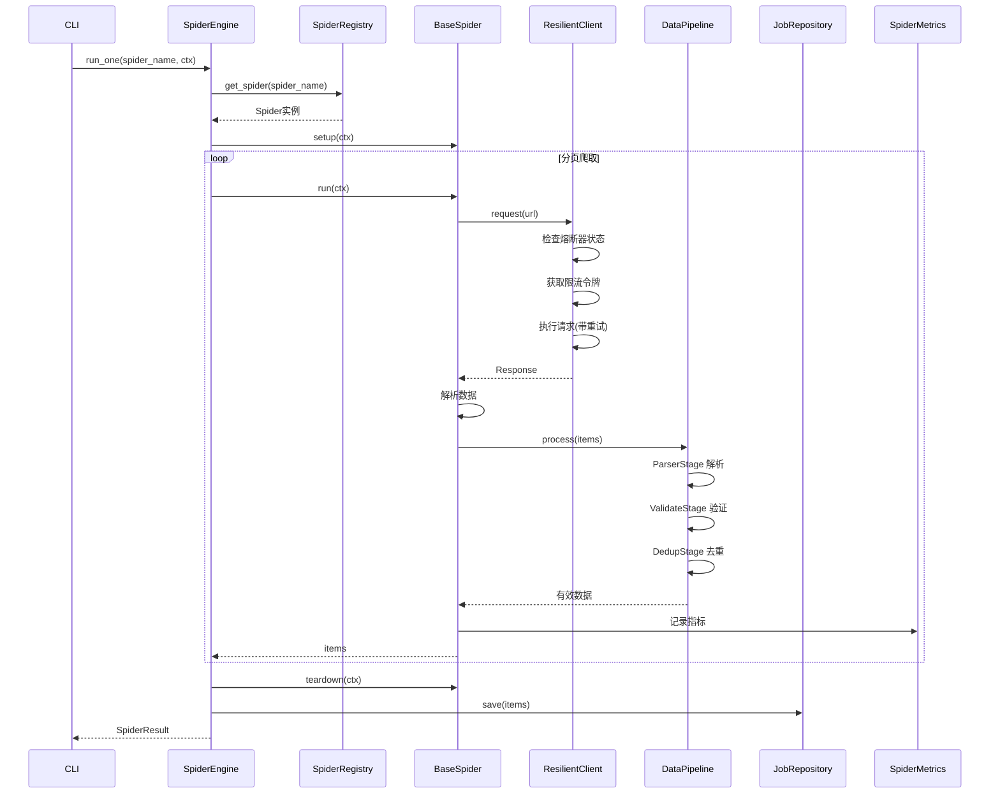
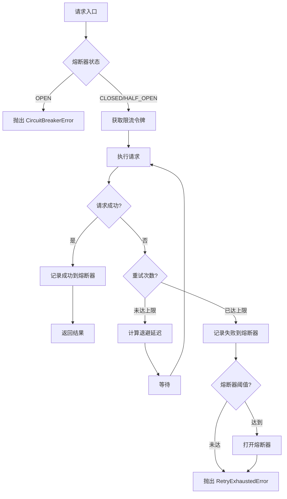
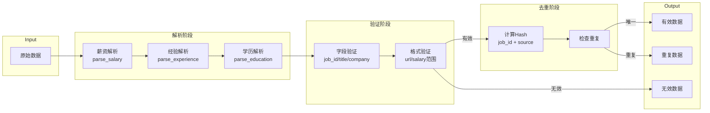

# Job Spider - 招聘数据爬虫系统

企业级招聘网站数据采集系统，支持智联招聘、前程无忧、Boss直聘等主流招聘平台。

## 功能特性

- 🔍 多平台职位搜索
- 📊 薪资数据分析
- 🔄 定时自动爬取
- 📈 数据导出（CSV/Excel）
- 🛡️ 完善的反爬策略
- 🐳 Docker 容器化部署
- 📊 Prometheus 监控告警

## 架构设计

### 整体架构图



### 爬虫执行流程



### 弹性调用流程



### 数据管道流程



### 部署架构

```mermaid
graph TB
    subgraph Docker["Docker Compose"]
        SPIDER[Spider Service<br/>爬虫服务]
        SCHED[Scheduler Service<br/>调度服务]
    end
    
    subgraph Volumes["持久化存储"]
        DATA[(data/<br/>SQLite数据库)]
        LOGS[(logs/<br/>日志文件)]
        OUTPUT[(output/<br/>导出文件)]
        BROWSER[(browser_state/<br/>登录状态)]
    end
    
    subgraph Monitoring["监控体系"]
        PROM[Prometheus<br/>指标采集]
        ALERT[AlertManager<br/>告警管理]
        GRAF[Grafana<br/>可视化]
    end
    
    subgraph Health["健康检查"]
        HC[/health<br/>存活探针]
        RD[/ready<br/>就绪探针]
    end
    
    SPIDER --> DATA
    SPIDER --> LOGS
    SPIDER --> OUTPUT
    SPIDER --> BROWSER
    
    SCHED --> DATA
    SCHED --> LOGS
    
    SPIDER --> PROM
    PROM --> ALERT
    PROM --> GRAF
    
    SPIDER --> HC
    SPIDER --> RD
```

## 快速开始

### 环境要求

- Python 3.10+
- uv（推荐）或 pip

### 安装

```bash
# 使用 uv（推荐）
uv sync --all-extras

# 或使用 pip
pip install -e ".[dev]"
```

### 使用

```bash
# 初始化项目
python main.py init

# 列出可用爬虫
python main.py list-spiders

# 爬取智联招聘数据
python main.py crawl zhilian -k "Python开发" -c "深圳" -l 100

# 使用浏览器模式（处理反爬）
python main.py crawl zhilian-browser -k "Python" -c "北京" --login

# 查看统计
python main.py stats

# 导出数据
python main.py export --format excel --output output/jobs.xlsx

# 启动健康检查服务
python main.py health --port 8080

# 启动指标服务
python main.py metrics-server --port 8000
```

## 项目结构

```
job-spider/
├── config/                    # 配置模块
│   ├── settings.py           # 配置管理（pydantic-settings）
│   └── logging.py            # 日志配置（structlog）
│
├── src/job_spider/
│   ├── core/                  # 核心模块
│   │   ├── engine.py         # 爬虫引擎
│   │   ├── registry.py       # 爬虫注册中心
│   │   ├── context.py        # 执行上下文
│   │   └── shutdown.py       # 优雅关闭管理
│   │
│   ├── spiders/               # 爬虫实现
│   │   ├── base.py           # 爬虫基类
│   │   ├── zhilian.py        # 智联招聘
│   │   ├── zhilian_browser.py# 智联浏览器模式
│   │   ├── job51.py          # 前程无忧
│   │   └── mock.py           # 测试爬虫
│   │
│   ├── middleware/            # 中间件
│   │   ├── resilience.py     # 弹性客户端（重试+熔断+限流）
│   │   ├── retry.py          # 重试策略
│   │   ├── circuit_breaker.py# 熔断器
│   │   ├── rate_limiter.py   # 限流器
│   │   ├── user_agent.py     # UA 轮换
│   │   └── proxy.py          # 代理管理
│   │
│   ├── pipeline/              # 数据管道
│   │   ├── base.py           # 管道基类
│   │   ├── parser.py         # 数据解析
│   │   ├── validator.py      # 数据验证
│   │   └── deduper.py        # 数据去重
│   │
│   ├── storage/               # 存储层
│   │   ├── database.py       # 数据库管理
│   │   ├── models.py         # 数据模型
│   │   ├── repository.py     # 数据仓库
│   │   ├── backup.py         # 数据备份
│   │   └── exporter.py       # 数据导出
│   │
│   ├── observability/         # 可观测性
│   │   ├── metrics.py        # 指标收集
│   │   ├── metrics_server.py # 指标服务
│   │   └── tracing.py        # 链路追踪
│   │
│   ├── health/                # 健康检查
│   │   └── server.py         # 健康服务
│   │
│   ├── scheduler/             # 调度器
│   │   └── scheduler.py      # 定时任务
│   │
│   └── utils/                 # 工具函数
│       ├── http.py           # HTTP 工具
│       └── parser.py         # 解析工具
│
├── monitoring/                # 监控配置
│   ├── prometheus.yml        # Prometheus 配置
│   ├── alertmanager.yml      # 告警路由
│   └── alerts.yml            # 告警规则
│
├── data/                      # 数据存储
├── output/                    # 导出文件
├── logs/                      # 日志
│
├── Dockerfile                 # Docker 构建
├── docker-compose.yml         # 容器编排
└── pyproject.toml            # 项目配置
```

## 支持的招聘网站

| 网站 | 状态 | 反爬等级 | 支持模式 |
|------|------|----------|----------|
| 智联招聘 | ✅ 已支持 | 低 | HTTP |
| 智联招聘 | ✅ 已支持 | 中 | 浏览器模式 |
| 前程无忧 | 🚧 开发中 | 中 | HTTP |
| Boss直聘 | 📋 计划中 | 高 | 浏览器模式 |

## 监控告警

### Prometheus 指标

| 指标 | 类型 | 说明 |
|------|------|------|
| `job_spider_requests_total` | Counter | 请求总数 |
| `job_spider_request_duration_seconds` | Histogram | 请求延迟 |
| `job_spider_items_total` | Counter | 爬取数据量 |
| `job_spider_errors_total` | Counter | 错误数 |
| `job_spider_active_spiders` | Gauge | 活跃爬虫数 |

### 告警规则

- **SpiderHighFailureRate**: 爬虫失败率 > 50%
- **SpiderConsecutiveFailures**: 连续 5 次失败
- **SpiderHighLatency**: 请求延迟 P99 > 30s

## 开发

```bash
# 安装开发依赖
uv sync --all-extras

# 运行测试
uv run pytest tests/ --cov=src

# 代码检查
uv run ruff check src/ tests/

# 代码格式化
uv run black src/
uv run isort src/

# 类型检查
uv run mypy src/
```

## License

MIT
