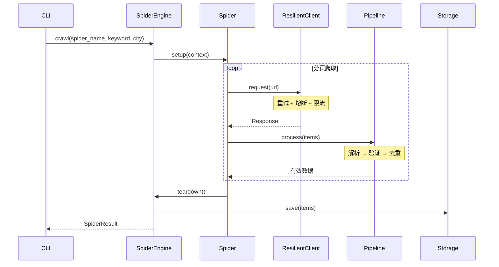

<div align="center">

# 🕷️ Job Spider

**企业级招聘数据采集框架，让爬虫开发像写配置一样简单**

[](https://www.python.org/downloads/)
[](https://opensource.org/licenses/MIT)
[](https://github.com/psf/black)

[快速开始](#-快速开始) • [特性亮点](#-为什么选择-job-spider) • [架构设计](#-架构设计) • [示例代码](#-扩展示例)

</div>

---

## 🎯 一句话介绍

**Job Spider 是一个生产级的招聘数据采集框架，内置重试/熔断/限流/监控，支持智联招聘、前程无忧、Boss直聘等主流平台。**

你是否遇到过这些问题？
- ❌ 爬虫写着写着就挂了，没有重试机制
- ❌ 被反爬封 IP，没有熔断保护
- ❌ 请求太快被限流，没有速率控制
- ❌ 数据重复入库，没有去重管道
- ❌ 运行状态黑盒，没有监控指标

**Job Spider 开箱即用解决以上所有问题！**

---

## ✨ 为什么选择 Job Spider

### 🚀 生产级可靠性

| 特性 | 描述 |
|------|------|
| **弹性客户端** | 内置重试 + 熔断 + 限流，告别脆弱爬虫 |
| **数据管道** | 解析 → 验证 → 去重，一行配置搞定 |
| **可观测性** | Prometheus 指标 + 健康检查 + 结构化日志 |
| **优雅关闭** | 信号处理 + 任务清理，数据不丢失 |

### 🧩 极简扩展

新增一个爬虫只需继承 `BaseSpider` 并实现 `search()` 方法：

```python
from job_spider.spiders import BaseSpider, SpiderRegistry, SpiderContext

@SpiderRegistry.register("my-spider")
class MySpider(BaseSpider):
    async def search(self, ctx: SpiderContext) -> list[JobItem]:
        # 你的爬虫逻辑
        response = await self.client.get(ctx.url)
        return [JobItem(...), ...]
```

框架自动处理：请求重试、限流控制、数据去重、指标上报。

### 📊 开箱即用的监控

```bash
# 启动指标服务
python main.py metrics-server --port 8000

# 访问 Prometheus 格式指标
curl http://localhost:8000/metrics
```

内置指标：
- `job_spider_requests_total` - 请求总数
- `job_spider_items_total` - 爬取数据量
- `job_spider_errors_total` - 错误统计
- `job_spider_request_duration_seconds` - 请求延迟分布

---

## ⚡ 快速开始

### 安装

```bash
# 使用 uv（推荐）
uv sync

# 或 pip
pip install -e .
```

### 30 秒上手

```bash
# 1. 初始化数据库
python main.py init

# 2. 查看可用爬虫
python main.py list-spiders

# 3. 开始爬取
python main.py crawl zhilian-browser -k "Python开发" -c "深圳" -l 100

# 4. 查看统计
python main.py stats

# 5. 导出数据
python main.py export -f excel -o output/jobs.xlsx
```

### 处理反爬网站

对于需要登录的网站（如智联招聘），先保存登录状态：

```bash
# 1. 手动登录并保存状态
python login_helper.py

# 2. 使用已保存的登录状态爬取
python main.py crawl zhilian-browser -k "Python" -c "北京"
```

---

## 🏗️ 架构设计

```
┌─────────────────────────────────────────────────────────────┐
│                         CLI Layer                            │
│                    (main.py + click)                         │
└──────────────────────────┬──────────────────────────────────┘
                           │
┌──────────────────────────▼──────────────────────────────────┐
│                      Spider Engine                           │
│         ┌─────────────────────────────────────┐              │
│         │  SpiderRegistry  SpiderContext      │              │
│         │  ShutdownManager                    │              │
│         └─────────────────────────────────────┘              │
└──────────────────────────┬──────────────────────────────────┘
                           │
┌──────────────────────────▼──────────────────────────────────┐
│                      Spider Layer                            │
│   ┌─────────┐ ┌─────────┐ ┌─────────┐ ┌─────────┐           │
│   │Zhilian  │ │ 51job   │ │ Boss    │ │ Mock    │  ...      │
│   └────┬────┘ └────┬────┘ └────┬────┘ └────┬────┘           │
└────────┼───────────┼───────────┼───────────┼─────────────────┘
         │           │           │           │
┌────────▼───────────▼───────────▼───────────▼─────────────────┐
│                    Middleware Layer                          │
│  ┌──────────────────────────────────────────────────────┐    │
│  │           ResilientClient (弹性客户端)                │    │
│  │  ┌─────────┐ ┌─────────┐ ┌─────────┐                 │    │
│  │  │  Retry  │ │Circuit  │ │  Rate   │                 │    │
│  │  │ Policy  │ │Breaker  │ │Limiter  │                 │    │
│  │  └─────────┘ └─────────┘ └─────────┘                 │    │
│  └──────────────────────────────────────────────────────┘    │
└──────────────────────────┬───────────────────────────────────┘
                           │
┌──────────────────────────▼───────────────────────────────────┐
│                     Pipeline Layer                           │
│         Parser ──► Validator ──► Deduper                    │
└──────────────────────────┬───────────────────────────────────┘
                           │
┌──────────────────────────▼───────────────────────────────────┐
│                     Storage Layer                            │
│         Database ──► Repository ──► Exporter                │
└──────────────────────────────────────────────────────────────┘
```

### 核心流程



---

## 🔧 扩展示例

### 自定义爬虫

```python
from job_spider.spiders import BaseSpider, SpiderRegistry, SpiderContext, JobItem

@SpiderRegistry.register("my-spider")
class MySpider(BaseSpider):
    """自定义爬虫示例"""
    
    name = "my-spider"
    base_url = "https://example.com/jobs"
    
    async def search(self, ctx: SpiderContext) -> list[JobItem]:
        """实现搜索逻辑"""
        url = f"{self.base_url}?q={ctx.keyword}&city={ctx.city}"
        
        # 使用弹性客户端（自动重试、限流、熔断）
        response = await self.client.get(url)
        
        # 解析数据
        items = []
        for row in response.json()["data"]:
            items.append(JobItem(
                job_id=row["id"],
                title=row["title"],
                company=row["company"],
                salary=row["salary"],
                url=row["url"],
                source=self.name
            ))
        
        return items
```

### 自定义数据管道

```python
from job_spider.pipeline import PipelineStage

class CustomFilter(PipelineStage):
    """自定义过滤管道"""
    
    async def process(self, items: list[JobItem]) -> list[JobItem]:
        return [item for item in items 
                if "Python" in item.title]
```

---

## 📋 支持平台

| 平台 | 状态 | 反爬等级 | 模式 |
|------|------|----------|------|
| 智联招聘 | ✅ | 低 | HTTP |
| 智联招聘 | ✅ | 中 | 浏览器模式 |
| 前程无忧 | 🚧 | 中 | HTTP |
| Boss直聘 | 📋 | 高 | 浏览器模式 |
| RemoteOK | ✅ | 无 | API |

---

## 📦 部署

### Docker

```bash
# 构建镜像
docker build -t job-spider .

# 运行爬虫
docker run -v ./data:/app/data job-spider crawl zhilian -k "Python"

# Docker Compose（含监控）
docker-compose up -d
```

### 监控集成

```yaml
# prometheus.yml
scrape_configs:
  - job_name: 'job-spider'
    static_configs:
      - targets: ['localhost:8000']
```

---

## 🛠️ 开发

```bash
# 安装开发依赖
uv sync --all-extras

# 运行测试
uv run pytest tests/ --cov=src

# 代码检查
uv run ruff check src/

# 类型检查
uv run mypy src/
```

---

## 📄 License

[MIT](LICENSE)

---

## 🤝 贡献

欢迎 Issue 和 PR！

1. Fork 本仓库
2. 创建特性分支 (`git checkout -b feature/amazing-feature`)
3. 提交更改 (`git commit -m 'Add amazing feature'`)
4. 推送到分支 (`git push origin feature/amazing-feature`)
5. 创建 Pull Request

---

<div align="center">

**如果这个项目对你有帮助，请给一个 ⭐️ Star！**

Made with ❤️ by [afine907](https://github.com/afine907)

</div>
